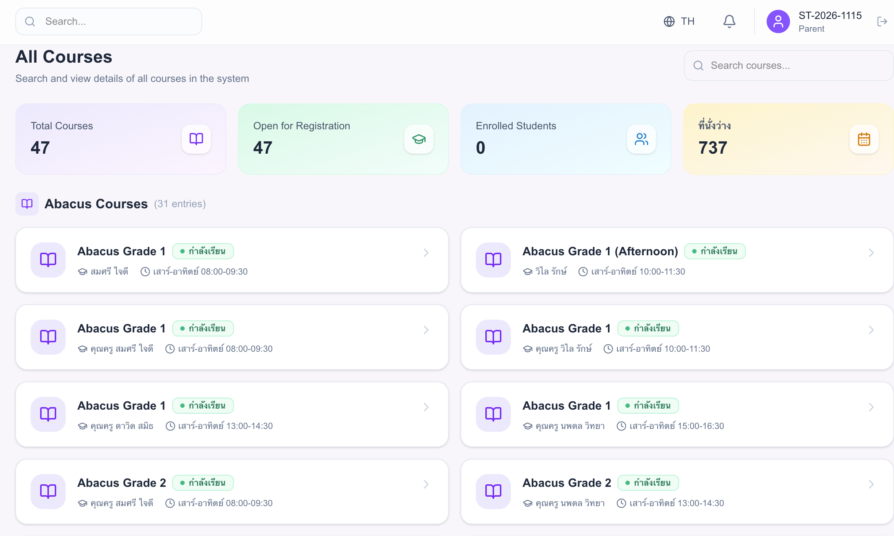
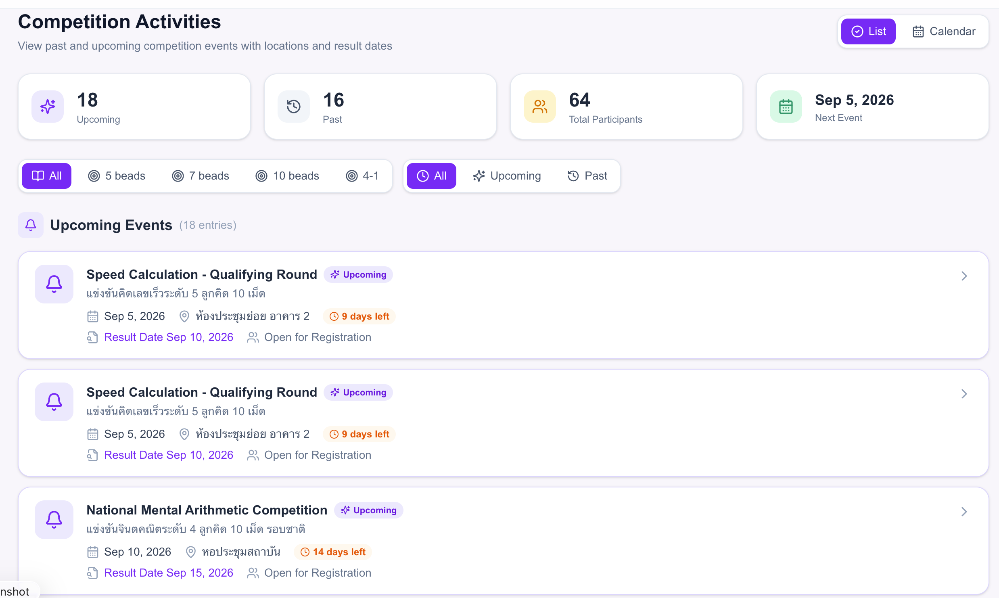

# Clickstream Pipeline — Kafka → Snowflake → dbt

Ingests `clickstream.events` from Kafka into Snowflake via the **Snowflake Connector
for Kafka v4** (Snowpipe Streaming), landing raw JSON in `ABACUS_ANALYTICS.RAW`.
Everything downstream of the landing table is transformed by **dbt** (dbt Core 2.0,
Snowflake adapter): typed staging views, an intermediate layer of conformed events
and interaction features, and recommendation marts.

```
producer → kafka → connect worker → snowflake ─── dbt ──────────────────────┐
                                    │                                       │
                                    └── RAW.CLICKSTREAM_EVENTS              │
                                        (raw JSON, append-only)             │
                                                                            ▼
                                    STAGING.STG_*          typed views, deduped
                                    INTERMEDIATE.INT_*     conformed events, affinity
                                    MARTS.*                recommendations
```

**Ingestion is configuration.** The connector writes what the producer sent, and
`RAW` is never edited. A producer-side schema change never means rewriting landed
data.

**Transformation is code.** Every view and table downstream of `RAW` is a dbt model
in this repo, built by `dbt run`, with dependencies declared through `source()` and
`ref()` so dbt resolves build order itself.

| Layer | Schema | Materialization | Owner |
|---|---|---|---|
| Landing | `RAW` | table | Kafka connector |
| Postgres sync | `RAW_APP` | table | external sync, typed at source |
| Staging | `STAGING` | view | dbt |
| Intermediate | `INTERMEDIATE` | table | dbt |
| Marts | `MARTS` | table | dbt |

## The source application

Events come from an education platform for abacus (mental arithmetic) and early
child-development programs, running locally at `http://localhost:3000`. Parents and
students use it to browse and register for courses, track learning progress, and
find skills competitions.

Every interaction emits a JSON event to the `clickstream.events` topic, so clicking
through the UI exercises the whole pipeline — no synthetic producer needed.

**All course**



**Learning Path**


**Competition Activities**



Clicking a competition here produces a `competition_viewed` event; scrolling and
staying on the page produces `page_dwell` and `course_card_clicked`.

---

## Contents

- [Prerequisites](#prerequisites)
- [Phase 1 — Snowflake: the destination](#phase-1--snowflake-the-destination)
- [Phase 2 — Keys: the identity](#phase-2--keys-the-identity)
- [Phase 3 — The connector](#phase-3--the-connector)
- [Phase 4 — Confirm](#phase-4--confirm)
- [Phase 5 — dbt: transformation as code](#phase-5--dbt-transformation-as-code)
- [Operating the connector](#operating-the-connector)
- [Running dbt](#running-dbt)
- [Troubleshooting — connector](#troubleshooting--connector)
- [Troubleshooting — dbt](#troubleshooting--dbt)
- [Repository layout](#repository-layout)
- [Status](#status)

---

## Prerequisites

| Requirement | Notes |
|---|---|
| Snowflake account with `ACCOUNTADMIN` | Account identifier: `KNSMANR-BL10477` |
| Kafka broker reachable from the Connect worker | Internal listener `kafka:9092` |
| Docker with Compose | Kafka, Redpanda Console and Connect all run here |
| `openssl`, `jq`, `curl` | Standard on macOS |
| Python 3.10+ with `dbt-core` and `dbt-snowflake` | dbt Core 2.0; runs on the host, not in Docker |

---

## Phase 1 — Snowflake: the destination

### 1. Database and schemas

```sql
USE ROLE ACCOUNTADMIN;

CREATE DATABASE IF NOT EXISTS ABACUS_ANALYTICS;
CREATE SCHEMA   IF NOT EXISTS ABACUS_ANALYTICS.RAW;           -- append-only JSON landing
CREATE SCHEMA   IF NOT EXISTS ABACUS_ANALYTICS.RAW_APP;       -- Postgres sync, typed at source
CREATE SCHEMA   IF NOT EXISTS ABACUS_ANALYTICS.STAGING;       -- dbt: typed views over RAW
CREATE SCHEMA   IF NOT EXISTS ABACUS_ANALYTICS.INTERMEDIATE;  -- dbt: conformed events, features
CREATE SCHEMA   IF NOT EXISTS ABACUS_ANALYTICS.MARTS;         -- dbt: recommendations
```

A Personal Database (`USER$<name>`) will **not** work as a target — privileges on
its objects cannot be granted to account roles, `CREATE` least of all.

### 2. Role and service user

```sql
CREATE ROLE IF NOT EXISTS KAFKA_INGEST_ROLE;

CREATE USER IF NOT EXISTS KAFKA_INGEST_SVC
    TYPE         = SERVICE
    DEFAULT_ROLE = KAFKA_INGEST_ROLE;
```

`TYPE = SERVICE` cannot hold a password and cannot enrol in MFA, so key-pair auth is
the only way in. That is all connector v4 supports, and what Snowflake now requires
for non-human users.

**Gate** — `SHOW USERS LIKE 'KAFKA_INGEST_SVC';` must return one row.

---

## Phase 2 — Keys: the identity

There are **two** identities in this pipeline, each with its own key pair. Do not
share one key between them: rotating it would break both systems, and it blurs which
system performed which action in the audit trail.

| Identity | Type | Key | Used by |
|---|---|---|---|
| `KAFKA_INGEST_SVC` | `SERVICE` | `connectors/secrets/sf_key.p8` | Kafka connector, writes `RAW` |
| `BANASPIH` (human) | `PERSON` | `~/.snowflake/dbt_rsa_key.p8` | dbt, reads `RAW`, writes everything else |

Phase 2 covers the connector's key. The dbt key is in
[Phase 5](#phase-5--dbt-transformation-as-code).

### 3. Generate the key pair

Find the host folder mounted into the container first, so the files land where the
connector can read them:

```bash
docker inspect connect \
  --format '{{range .Mounts}}{{.Source}} -> {{.Destination}}{{"\n"}}{{end}}'
```

Then, inside the path that maps to `/opt/kafka/secrets`:

```bash
openssl genrsa 2048 | openssl pkcs8 -topk8 -inform PEM -nocrypt -out sf_key.p8
openssl rsa -in sf_key.p8 -pubout -out sf_key.pub
```

**Gate** — the one that cost the most time.

```bash
head -1 sf_key.pub    # must print: -----BEGIN PUBLIC KEY-----
```

If it says `PRIVATE` or `ENCRYPTED`, stop and regenerate. Every later step fails in a
way that never mentions keys.

Two files, two destinations:

| File | Half | Goes to |
|---|---|---|
| `sf_key.p8` | private | stays on this machine, read by the connector |
| `sf_key.pub` | public | registered in Snowflake |

Quick identification: a 2048-bit **public** key body starts
`MIIBIjANBgkqhkiG9w0BAQEFAAOCAQ8A` and runs ~392 chars. A **private** key starts
`MIIEv` / `MIIEp` / `MIIFD` and runs 1200+.

### 4. Private half → the secrets file

```bash
printf 'private_key=%s\n' "$(grep -v '^-----' sf_key.p8 | tr -d '\n')" \
  > snowflake.properties
chmod 600 snowflake.properties
```

**Gate**

```bash
wc -c snowflake.properties    # ~1637 bytes. ~13 means it is EMPTY.
wc -l snowflake.properties    # must be 1 — a newline breaks the parser
```

Do not use a heredoc here. If the `$(grep …)` substitution fails, a heredoc writes
the file anyway with an empty value and says nothing.

### 5. Public half → Snowflake

Generate the whole statement so there is nothing to hand-edit:

```bash
echo "ALTER USER KAFKA_INGEST_SVC SET RSA_PUBLIC_KEY = '$(grep -v '^-----' sf_key.pub | tr -d '\n')';" | pbcopy
```

Paste into Snowsight and run.

**Gate** — `DESC USER KAFKA_INGEST_SVC;` → `RSA_PUBLIC_KEY_FP` must show `SHA256:…`.
Blank means it did not register.

### 6. Grants

```sql
GRANT USAGE        ON DATABASE ABACUS_ANALYTICS     TO ROLE KAFKA_INGEST_ROLE;
GRANT USAGE        ON SCHEMA   ABACUS_ANALYTICS.RAW TO ROLE KAFKA_INGEST_ROLE;
GRANT CREATE TABLE ON SCHEMA   ABACUS_ANALYTICS.RAW TO ROLE KAFKA_INGEST_ROLE;

GRANT ROLE KAFKA_INGEST_ROLE TO USER KAFKA_INGEST_SVC;
```

`CREATE TABLE` because the connector creates its own target — and owns what it
creates, so `INSERT` comes along automatically. No warehouse grant: Snowpipe
Streaming ingestion is serverless.

So you can read the data yourself afterwards:

```sql
GRANT ROLE KAFKA_INGEST_ROLE TO ROLE SYSADMIN;
GRANT SELECT ON FUTURE TABLES IN SCHEMA ABACUS_ANALYTICS.RAW TO ROLE SYSADMIN;
```

Without this, even `ACCOUNTADMIN` gets `Insufficient privileges` on the
connector-created table — it is owned by a role outside that hierarchy.
`FUTURE TABLES` covers every topic you add later.

**Gate** — `SHOW GRANTS TO ROLE KAFKA_INGEST_ROLE;` → four rows.

---

## Phase 3 — The connector

### 7. Connector config

`connectors/snowflake-sink-v4.json`

```json
{
  "name": "clickstream-snowflake-sink",
  "config": {
    "connector.class": "com.snowflake.kafka.connector.SnowflakeStreamingSinkConnector",
    "tasks.max": "4",

    "topics": "clickstream.events",
    "snowflake.topic2table.map": "clickstream.events:CLICKSTREAM_EVENTS",

    "snowflake.url.name": "https://KNSMANR-BL10477.snowflakecomputing.com",
    "snowflake.user.name": "KAFKA_INGEST_SVC",
    "snowflake.role.name": "KAFKA_INGEST_ROLE",
    "snowflake.database.name": "ABACUS_ANALYTICS",
    "snowflake.schema.name": "RAW",

    "snowflake.private.key": "${file:/opt/kafka/secrets/snowflake.properties:private_key}",

    "key.converter": "org.apache.kafka.connect.storage.StringConverter",
    "value.converter": "org.apache.kafka.connect.json.JsonConverter",
    "value.converter.schemas.enable": "false",

    "snowflake.enable.schematization": "true",
    "snowflake.streaming.validate.compatibility.with.classic": "false",

    "errors.tolerance": "all",
    "errors.log.enable": "true",
    "errors.deadletterqueue.topic.name": "clickstream.events.dlq",
    "errors.deadletterqueue.topic.replication.factor": "1"
  }
}
```

Every value must match Phase 1 exactly. That string matching, plus the key pair, is
the entire link between Kafka and Snowflake.

Three settings that are easy to get wrong:

- `snowflake.private.key` must use the **container** path `/opt/kafka/secrets/…`. A
  host path (`/Users/…`) fails with `Could not read properties from file` — the
  connector resolves it inside the container, where that path does not exist.
- `snowflake.streaming.validate.compatibility.with.classic: "false"` is required for
  a fresh install. v4 defaults it to `true`, which then demands four v3-migration
  settings and blocks startup. It exists to protect people migrating from connector
  v3; there is nothing to protect here.
- `…deadletterqueue.topic.replication.factor: "1"` on a single broker. With `3`, the
  first malformed message crashes the error handler itself.

Omit `snowflake.private.key.passphrase` entirely — the key above is `-nocrypt`.
Pointing it at a nonexistent properties entry resolves to empty and fails during
decryption.

### 8. Start the Connect worker

```bash
cd docker
docker compose -f docker-compose.yml -f docker-compose.connect.yml up -d
docker compose -f docker-compose.yml -f docker-compose.connect.yml logs -f connect
```

Pass both files so Connect joins the same Compose project as Kafka and can resolve
`kafka:9092`. A standalone run creates its own network, and the worker dies with
`No resolvable bootstrap urls given in bootstrap.servers`.

First start downloads the connector — allow two or three minutes. Port 8083 is
published immediately but accepts nothing until the JVM binds it.

**Gate** — three checks

```bash
docker exec connect ls -l /opt/kafka/secrets     # lists snowflake.properties
docker exec connect nc -zv kafka 9092            # network join works
curl -s localhost:8083/connector-plugins | jq -r '.[].class' | grep -i snowflake
```

An empty first result means the volume path is wrong. Docker creates an empty
directory rather than failing.

### 9. Deploy

```bash
curl -s -X POST -H "Content-Type: application/json" \
  --data @connectors/snowflake-sink-v4.json \
  localhost:8083/connectors | jq
```

Never use `curl -f` against the Connect API. It discards the response body on a
4xx/5xx — which is exactly where the error message lives.

```bash
curl -s localhost:8083/connectors/clickstream-snowflake-sink/status | jq
```

**Gate** — `state: RUNNING` for the connector and all four tasks.

Read the whole status object. `.connector.trace` and `.tasks[].trace` are different
failures, and a connector that fails during startup never creates tasks — so the task
array is empty and the only explanation is on the connector.

---

## Phase 4 — Confirm

### 10. Data is landing

```sql
SELECT TABLE_SCHEMA, TABLE_NAME, ROW_COUNT, CREATED
FROM ABACUS_ANALYTICS.INFORMATION_SCHEMA.TABLES
ORDER BY CREATED DESC;

SELECT * FROM ABACUS_ANALYTICS.RAW.CLICKSTREAM_EVENTS LIMIT 5;
DESC TABLE ABACUS_ANALYTICS.RAW.CLICKSTREAM_EVENTS;
```

With schematization on, each top-level JSON key becomes a column:

| Column | Type | Notes |
|---|---|---|
| `EVENT_TYPE`, `USER_ID`, `SESSION_ID`, `PAGE_URL` | `VARCHAR` | already typed |
| `TIMESTAMP` | `TIMESTAMP_NTZ` | already parsed — do not wrap in `TRY_TO_TIMESTAMP_TZ` |
| `METADATA` | `OBJECT` | nested fields, reached with `:` |
| `RECORD_METADATA` | `VARIANT` | Kafka topic / partition / offset |

This is the contract dbt builds on. `RAW` stays exactly what Kafka sent; all shaping
happens from here on, in dbt.

---

## Phase 5 — dbt: transformation as code

The typed views in `STAGING` were originally created by hand with
`CREATE OR REPLACE VIEW`, run statement by statement in Snowsight. They are now dbt
models: each file contains only a `SELECT`, and dbt generates the
`create or replace view` wrapper at run time. The declarative parts — which database
and schema `RAW` lives in, and whether a layer materializes as view or table — move
out of the SQL into configuration.

| Was | Now |
|---|---|
| `CREATE OR REPLACE VIEW STAGING.PAGE_DWELL AS …` | `models/staging/stg_page_dwell.sql` |
| `FROM ABACUS_ANALYTICS.RAW.CLICKSTREAM_EVENTS` | `{{ source('raw', 'clickstream_events') }}` |
| `CREATE OR REPLACE VIEW` in each script | `+materialized: view` on the folder |
| Run by hand in a worksheet | `dbt run --select staging` |
| `sql/02_view_page_dwell.sql`, `sql/03_…` | `dbt/models/staging/` |

What this buys over the hand-run scripts:

- **Lineage.** `source()` and `ref()` make the dependency graph explicit, so dbt
  builds staging → intermediate → marts in order without being told.
- **Tests as code.** `not_null` on `competition_id`, uniqueness on
  `(kafka_partition, kafka_offset)`, freshness on the landing table — `dbt test`
  instead of someone's memory.
- **One place for environment differences.** Dev and prod point at different schemas
  through the profile target; the model SQL is identical.
- **Version control and review.** A change to the flattening logic is a diff, not a
  worksheet someone re-ran.

### 11. dbt's identity: key-pair auth

dbt connects as the human user `BANASPIH`, not as `KAFKA_INGEST_SVC`. Two facts about
this account force key-pair auth:

- Browser SSO fails with `390190` — a deprecated `SAML_IDENTITY_PROVIDER` account
  parameter, fixable only account-side.
- Password auth requires MFA/TOTP, which no multi-threaded tool can satisfy: dbt
  opens one connection per thread.

Key-pair authentication is exempt from both.

```bash
mkdir -p ~/.snowflake
openssl genrsa 2048 | openssl pkcs8 -topk8 -inform PEM \
  -out ~/.snowflake/dbt_rsa_key.p8 -nocrypt
openssl rsa -in ~/.snowflake/dbt_rsa_key.p8 -pubout \
  -out ~/.snowflake/dbt_rsa_key.pub
chmod 600 ~/.snowflake/dbt_rsa_key.p8

# single-line public key body for the ALTER USER below
grep -v "^-" ~/.snowflake/dbt_rsa_key.pub | tr -d '\n'
```

```sql
ALTER USER BANASPIH SET RSA_PUBLIC_KEY='MIIBIjANBgkqh…';
DESC USER BANASPIH;   -- RSA_PUBLIC_KEY_FP must show SHA256:…
```

**Gate** — the local key's fingerprint must equal what Snowflake registered.
A mismatch is what produces `390144 JWT token is invalid`.

```bash
openssl rsa -in ~/.snowflake/dbt_rsa_key.p8 -pubout -outform DER 2>/dev/null \
  | openssl dgst -sha256 -binary | openssl enc -base64
# prefix with SHA256: and compare to RSA_PUBLIC_KEY_FP
```

Do **not** reuse `connectors/secrets/sf_key.p8`. That key is registered to
`KAFKA_INGEST_SVC`; Snowflake builds the JWT subject from `ACCOUNT.USER`, so signing
with it as `BANASPIH` fails with exactly the error above.

### 12. Role and grants for dbt

```sql
USE ROLE ACCOUNTADMIN;

CREATE ROLE IF NOT EXISTS DBT_ROLE;
GRANT ROLE DBT_ROLE TO USER BANASPIH;
GRANT ROLE DBT_ROLE TO ROLE SYSADMIN;

GRANT USAGE ON WAREHOUSE ABACUS_WH       TO ROLE DBT_ROLE;
GRANT USAGE ON DATABASE  ABACUS_ANALYTICS TO ROLE DBT_ROLE;

-- read the landing zone
GRANT USAGE  ON SCHEMA        ABACUS_ANALYTICS.RAW TO ROLE DBT_ROLE;
GRANT SELECT ON ALL TABLES    IN SCHEMA ABACUS_ANALYTICS.RAW TO ROLE DBT_ROLE;
GRANT SELECT ON FUTURE TABLES IN SCHEMA ABACUS_ANALYTICS.RAW TO ROLE DBT_ROLE;

-- write the transformed layers
GRANT ALL PRIVILEGES ON SCHEMA ABACUS_ANALYTICS.STAGING      TO ROLE DBT_ROLE;
GRANT ALL PRIVILEGES ON SCHEMA ABACUS_ANALYTICS.INTERMEDIATE TO ROLE DBT_ROLE;
GRANT ALL PRIVILEGES ON SCHEMA ABACUS_ANALYTICS.MARTS        TO ROLE DBT_ROLE;
GRANT CREATE SCHEMA  ON DATABASE ABACUS_ANALYTICS            TO ROLE DBT_ROLE;
```

Unlike the connector, dbt **does** need a warehouse — it runs SQL, which Snowpipe
Streaming ingestion does not.

**Gate**

```sql
USE ROLE DBT_ROLE;
SELECT COUNT(*) FROM ABACUS_ANALYTICS.RAW.CLICKSTREAM_EVENTS;
```

### 13. Project and profile

`dbt/dbt_project.yml`

```yaml
name: abacus_analytics
version: "1.0.0"
profile: abacus
model-paths: ["models"]

models:
  abacus_analytics:
    staging:
      +materialized: view
    intermediate:
      +materialized: table
    marts:
      +materialized: table
```

Config keys under `models:` map to **directory names** under `model-paths`. A key
matching no directory produces an `UnusedResourceConfigPath` warning — keep the
config tree and the folder tree in sync.

`~/.dbt/profiles.yml`

```yaml
abacus:
  target: dev
  outputs:
    dev:
      type: snowflake
      account: KNSMANR-BL10477
      user: BANASPIH
      private_key_path: ~/.snowflake/dbt_rsa_key.p8
      role: DBT_ROLE
      database: ABACUS_ANALYTICS
      warehouse: ABACUS_WH
      schema: STAGING
      threads: 4
```

Four things that will waste an afternoon if wrong:

- `account` is `<org>-<account_name>` with no `.snowflakecomputing.com` suffix.
  Confirm with
  `SELECT CURRENT_ORGANIZATION_NAME() || '-' || CURRENT_ACCOUNT_NAME();`
- `user` is the `LOGIN_NAME` from `DESC USER` — not the account name, not necessarily
  the email.
- Do **not** also set `password` or `authenticator`. Either one makes dbt warn that
  the key-pair credential is being ignored, and the connection follows the wrong auth
  path.
- dbt only reads a file named exactly `profiles.yml`. `dbt_projects_profiles.yml` in
  the project directory is the Snowflake-native dbt Projects artifact and is ignored
  by dbt Core. Every `dbt debug` prints which file it loaded — read that line.

The final schema is `target.schema` plus any custom schema, **concatenated**. With no
custom schema, models land in `STAGING`; a stray `+schema: staging` produces
`STAGING_staging`.

### 14. Sources

`dbt/models/staging/_sources.yml` is what makes `source()` resolve. Without it, any
model referencing the landing table fails at parse time with `DependencyNotFound`.

```yaml
version: 2

sources:
  - name: raw
    database: ABACUS_ANALYTICS
    schema: RAW
    tables:
      - name: clickstream_events
        loaded_at_field: '"TIMESTAMP"'
        freshness:
          warn_after:  {count: 1,  period: hour}
          error_after: {count: 12, period: hour}
```

The two arguments to `source('raw', 'clickstream_events')` match the `name:` keys
only — they are independent of the actual schema name. The fact that the source is
*called* `raw` and its schema is *also* `RAW` is convention, not requirement.

**Gate** — `dbt ls --resource-type source` must print
`abacus_analytics.raw.clickstream_events`.

### 15. Staging models

One model per event type. Rename, cast, flatten `METADATA` — nothing else. No joins,
no aggregation, no business logic.

Materialized as **views**: staging is a rename layer over data that already exists in
`RAW`, Kafka streams into it continuously, and a view is always current without
storing a second copy.

**Deduplicate once**, in a base model, not in each typed model. Kafka is
at-least-once and a connector restart re-delivers messages.
`(RECORD_METADATA:partition, RECORD_METADATA:offset)` is unique and stable, so it is
both the dedupe key and the way to trace a row back to the topic.

```sql
-- models/staging/base_clickstream_events.sql
{{ config(materialized='view') }}

select *
from {{ source('raw', 'clickstream_events') }}
qualify row_number() over (
    partition by record_metadata:partition::int,
                 record_metadata:offset::bigint
    order by 1
) = 1
```

Every typed model then reads `{{ ref('base_clickstream_events') }}` and filters by
`event_type`. In the hand-written views this dedupe existed only in `PAGE_DWELL`, so
`COMPETITION_VIEWED` and `COURSE_CARD_CLICKED` double-counted on restart. One base
model fixes all three at once — the kind of thing that is awkward with maintained DDL
and natural with `ref()`.

```sql
-- models/staging/stg_page_dwell.sql

select
    event_type,
    session_id,
    user_id,
    "TIMESTAMP"::timestamp_ntz                          as event_ts_utc,
    convert_timezone('UTC', 'Asia/Bangkok',
        "TIMESTAMP"::timestamp_ntz)                     as event_ts_local,
    metadata:dwell_seconds::int                         as dwell_seconds_raw,
    least(metadata:dwell_seconds::int, 300)             as dwell_seconds_capped,
    metadata:scroll_depth_pct::int                      as scroll_depth_pct,
    metadata:page::string                               as page,
    metadata:referer::string                            as referer,
    metadata:ip::string                                 as ip,
    metadata:user_agent::string                         as user_agent,
    record_metadata:partition::int                      as kafka_partition,
    record_metadata:offset::bigint                      as kafka_offset
from {{ ref('base_clickstream_events') }}
where event_type = 'page_dwell'
```


```sql
-- models/staging/stg_competition_viewed.sql

select
    event_type,
    session_id,
    user_id,
    "TIMESTAMP"::timestamp_ntz                          as event_ts_utc,
    convert_timezone('UTC', 'Asia/Bangkok',
        "TIMESTAMP"::timestamp_ntz)                     as event_ts_local,
    metadata:action::string                             as action,
    metadata:competition_id::string                     as competition_id,
    metadata:competition_name::string                   as competition_name,
    metadata:competition_name_en::string                as competition_name_en,
    metadata:grade::string                              as grade,
    metadata:program::string                            as program,
    metadata:language::string                           as language,
    metadata:source::string                             as source,
    metadata:referer::string                            as referer,
    metadata:ip::string                                 as ip,
    metadata:user_agent::string                         as user_agent,
    record_metadata:partition::int                      as kafka_partition,
    record_metadata:offset::bigint                      as kafka_offset
from {{ ref('base_clickstream_events') }}
where event_type = 'competition_viewed'
```


```sql
-- models/staging/stg_course_card_clicked.sql

select
    event_type,
    session_id,
    user_id,
    "TIMESTAMP"::timestamp_ntz                          as event_ts_utc,
    convert_timezone('UTC', 'Asia/Bangkok',
        "TIMESTAMP"::timestamp_ntz)                     as event_ts_local,
    metadata:action::string                             as action,
    metadata:course_id::string                          as course_id,
    metadata:course_name::string                        as course_name,
    metadata:course_name_en::string                     as course_name_en,
    metadata:path_type::string                          as path_type,
    metadata:language::string                           as language,
    metadata:source::string                             as source,
    metadata:referer::string                            as referer,
    metadata:ip::string                                 as ip,
    metadata:user_agent::string                         as user_agent,
    record_metadata:partition::int                      as kafka_partition,
    record_metadata:offset::bigint                      as kafka_offset
from {{ ref('base_clickstream_events') }}
where event_type = 'course_card_clicked'
```


**Casting rules for this data**

- `:` walks into JSON, `::` casts out of VARIANT. `METADATA:dwell_seconds::INT`.
  `METADATA::dwell_seconds` means "cast to a type named `DWELL_SECONDS`" and errors.
- `ip` is always `::STRING` — values include `::1` (IPv6 loopback).
- Comparisons use `=` and single quotes: `event_type = 'page_dwell'`. Double quotes
  mean an identifier; `==` is not SQL.
- Every `:` path needs a `::type`. Without it you get a VARIANT, and
  `METADATA:page = '/activities'` will not match because the JSON string keeps its
  quotes.
- `"TIMESTAMP"` is quoted because `timestamp` is a Snowflake reserved word. It is
  already `TIMESTAMP_NTZ`; the explicit `::timestamp_ntz` is defensive, so
  `CONVERT_TIMEZONE`'s three-argument form is guaranteed a real timestamp.
- Each alias in a view's final `SELECT` must be unique. Snowflake upper-cases
  unquoted identifiers, so extracting `competition_id` twice — once from `METADATA`,
  once from a URL parse — fails with `duplicate column name 'COMPETITION_ID'`.

**Data quality note.** Observed rows include `dwell_seconds: 1448` with
`scroll_depth_pct: 100` — a tab left open, not engagement. The model above keeps both
`dwell_seconds_raw` and `dwell_seconds_capped`; everything downstream uses the capped
column.

**Gate**

```sql
SELECT page, COUNT(*) AS events, AVG(dwell_seconds_capped) AS avg_dwell
FROM ABACUS_ANALYTICS.STAGING.STG_PAGE_DWELL
GROUP BY page ORDER BY events DESC;
```

**Migration note.** dbt's models are named after their files, so
`STAGING.STG_PAGE_DWELL` is a different object from the hand-made
`STAGING.PAGE_DWELL` — nothing is overwritten. Once the dbt models are verified,
drop the originals so two definitions cannot drift apart. Save them first if you want
the history:

```sql
SELECT GET_DDL('VIEW', 'ABACUS_ANALYTICS.STAGING.PAGE_DWELL');
DROP VIEW ABACUS_ANALYTICS.STAGING.PAGE_DWELL;
DROP VIEW ABACUS_ANALYTICS.STAGING.COMPETITION_VIEWED;
DROP VIEW ABACUS_ANALYTICS.STAGING.COURSE_CARD_CLICKED;
```

To keep the original names instead, add `{{ config(alias='page_dwell') }}` to the
model and let dbt take ownership of that object.

### 16. Intermediate layer

Staging says *what happened*. Intermediate says *what does this actor like, and which
items go together*. Marts say *what to show actor X*.

Rules for this layer:

1. **Never use `source()`** — only `ref()`. If a raw column is missing, add it to
   staging.
2. **Declare the grain in a comment at the top** of every model:
   `-- grain: one row per actor_id + item_id`. Every bug in this layer is a grain
   bug — a join that fanned out and silently doubled the counts.
3. **Name models `int_<entity>_<verb past tense>.sql`** — `int_events_unioned`,
   `int_dwell_attributed`. The verb says what the model did.
4. **Materialize as tables.** This layer does real work; compute once per run.
5. **Conform before aggregating.** Competitions and courses use different column
   names for the same concept. Normalize to `(item_type, item_id)` once and every
   model after that serves both without being written twice.
6. **Dedupe belongs in staging**, so anything reading staging directly is also
   correct.
7. **Nothing outside dbt reads this layer.** It is scaffolding and must stay free to
   be restructured. Marts are the contract.

Two design decisions specific to this data:

**Anonymous traffic.** `user_id` is null for most events. Use
`coalesce(user_id, 'anon:' || session_id) as actor_id` rather than discarding them —
session-scoped identity is weaker than a real user id, but it is most of the signal.

**Dwell attribution.** `page_dwell` identifies its page by URL, not by
`competition_id` or `course_id`, so dwell has to be attached to an item before it can
weight anything. Prefer parsing the id out of `page`:

```sql
regexp_substr(page, 'competitions/([A-Za-z0-9_-]+)', 1, 1, 'e', 1) as item_id
```

Where the URL does not carry the id, attribute by session sequence — the dwell event
belongs to the last item touched in that session. Snowflake's `ASOF JOIN` does this
without a window function and without fanning out:

```sql
-- models/intermediate/int_dwell_attributed.sql
-- grain: one row per dwell event, with the item it most likely refers to

with dwell as (
    select
        coalesce(user_id, 'anon:' || session_id) as actor_id,
        session_id,
        event_ts_utc,
        dwell_seconds_capped,
        scroll_depth_pct,
        page
    from {{ ref('stg_page_dwell') }}
),

items as (
    select actor_id, session_id, item_type, item_id, event_ts_utc
    from {{ ref('int_events_unioned') }}
)

select
    d.actor_id,
    d.session_id,
    i.item_type,
    i.item_id,
    d.event_ts_utc,
    d.dwell_seconds_capped,
    d.scroll_depth_pct,
    d.page,
    datediff('second', i.event_ts_utc, d.event_ts_utc) as seconds_after_item_view
from dwell d
asof join items i
    match_condition (d.event_ts_utc >= i.event_ts_utc)
    on d.session_id = i.session_id
where datediff('second', i.event_ts_utc, d.event_ts_utc) <= 1800
```

The 1800-second guard stops a dwell event being attributed to something looked at an
hour earlier. Attribution by proximity is a heuristic — label it as one, because
heuristics become facts once they are three models deep.

The models in this layer:

| Model | Grain | Purpose |
|---|---|---|
| `int_events_unioned` | one interaction event | conforms competitions + courses to `(item_type, item_id)` |
| `int_dwell_attributed` | one dwell event | attaches dwell to the item it refers to |
| `int_actor_item_affinity` | actor + item | weighted affinity score per actor/item pair |

Tests are the grain assertion made executable:

```yaml
# models/intermediate/_int_models.yml
version: 2

models:
  - name: int_actor_item_affinity
    description: One row per actor and item, with weighted affinity.
    tests:
      - dbt_utils.unique_combination_of_columns:
          combination_of_columns: [actor_id, item_type, item_id]
    columns:
      - name: affinity_score
        tests:
          - not_null
```

That test fails the run the moment a join starts fanning out, instead of you noticing
skewed recommendations three weeks later. Needs `dbt_utils` in `packages.yml`.

### 17. Marts

Business-facing, stable column names, materialized as tables. The only layer an
application, BI tool, or teammate should query.

Item–item co-occurrence with a popularity fallback for cold-start actors:

| Model | Purpose |
|---|---|
| `int_competition_cooccurrence` | "actors who viewed this also viewed that" |
| `int_competition_popularity` | 30-day popularity, the cold-start answer |
| `competition_recommendations` | top 10 per actor, excluding already-seen items |

A read role gets access through an `on-run-end` hook, once one exists:

```yaml
# on-run-end:
#   - "GRANT SELECT ON ALL VIEWS  IN SCHEMA {{ target.schema }} TO ROLE ANALYST"
#   - "GRANT SELECT ON ALL TABLES IN SCHEMA {{ target.schema }} TO ROLE ANALYST"
```

Commented out until the role is created — a hook referencing a nonexistent role fails
every run. Note both lines: staging models are views but marts are tables, and a
views-only grant silently misses them. Grants on `ALL` are point-in-time;
`GRANT … ON FUTURE` configured once in Snowsight is generally better than re-granting
on every run.

---

## Operating the connector

```bash
# list connectors
curl -s localhost:8083/connectors | jq

# health (use this most)
curl -s localhost:8083/connectors/clickstream-snowflake-sink/status | jq

# update config on a running connector — inner config object only
jq .config connectors/snowflake-sink-v4.json | \
  curl -s -X PUT -H "Content-Type: application/json" --data @- \
  localhost:8083/connectors/clickstream-snowflake-sink/config | jq

# restart failed tasks
curl -s -X POST "localhost:8083/connectors/clickstream-snowflake-sink/restart?includeTasks=true&onlyFailed=true"

# remove (Kafka offsets are retained, so recreating resumes)
curl -s -X DELETE localhost:8083/connectors/clickstream-snowflake-sink
```

`POST` creates, `PUT /config` updates. POSTing an existing name returns 409.

Check the topic and consumer lag:

```bash
docker exec docker-kafka-1 /opt/kafka/bin/kafka-get-offsets.sh \
  --bootstrap-server localhost:9092 --topic clickstream.events

docker exec docker-kafka-1 /opt/kafka/bin/kafka-consumer-groups.sh \
  --bootstrap-server localhost:9092 --describe \
  --group connect-clickstream-snowflake-sink
```

`LAG 0` means the connector consumed everything — and since Connect commits offsets
only after a successful write, the rows reached Snowflake.

Redpanda Console at `http://localhost:8080` is faster for browsing topics.


---

## Running dbt

```bash
cd dbt

dbt deps                                   # install packages (dbt_utils)
dbt debug                                  # profile + connection
dbt ls --resource-type source               # sources registered?
dbt parse                                  # whole-project parse, no warehouse work
dbt run --select stg_competition_viewed     # one model
dbt run --select staging                    # one layer
dbt run                                    # full project
dbt test                                   # data quality assertions
dbt source freshness                       # is Kafka still landing rows?
dbt docs generate && dbt docs serve         # lineage graph
```

Run from the project root, where `dbt_project.yml` lives. Running from
`models/staging/` is why `dbt debug --profiles-dir .` fails with
`No profiles.yml found at ./profiles.yml`.

`--select` filters what **executes**, not what **parses**. dbt parses every file
under `model-paths` and builds the full manifest first, so a broken reference in a
file you did not select still fails the run. The load order on every invocation:

1. `dbt_project.yml` from the current directory — establishes project name, paths and
   which profile to look up.
2. The profile — `--profiles-dir` flag, then `DBT_PROFILES_DIR`, then the current
   directory, then `~/.dbt/profiles.yml`. dbt prints which one it used.
3. Every `.sql` and `.yml` under the configured paths — YAML sources *create* nodes,
   YAML `models:` entries *decorate* existing ones.
4. Jinja resolution: `source()` and `ref()` become fully-qualified names.
5. DAG build, `--select` filter, compile to `target/compiled/`, execute, wrapped SQL
   written to `target/run/`, results in `target/run_results.json`.

Useful during debugging:

```bash
dbt compile --select stg_competition_viewed
cat target/compiled/abacus_analytics/models/staging/stg_competition_viewed.sql
```

That file is the SQL Snowflake actually received — the fastest way to see what a
macro or `source()` expanded to.

---

## Troubleshooting — connector

| Symptom | Cause | Fix |
|---|---|---|
| `User 'KAFKA_INGEST_SVC' does not exist` | Snowsight ran only one statement | Use **Run All**, or run statements individually |
| `New public key rejected … 'Invalid Public key'` | Pasted the private key | `head -1 sf_key.pub` must say `PUBLIC` |
| Connector `FAILED`, `tasks: []` | Config validation failed at startup | Read `.connector.trace`, not `.tasks[]` |
| `Config value 'snowflake.streaming.classic.offset.migration' is invalid` | v4 compatibility gate | Set `…validate.compatibility.with.classic: "false"` |
| `Could not read properties from file /Users/…` | Host path in `${file:…}` | Use `/opt/kafka/secrets/…` |
| `No resolvable bootstrap urls` | Connect on the wrong Docker network | Run both compose files as one project |
| `Recv failure: Connection reset by peer` | Worker still starting | `until curl -sf localhost:8083/; do sleep 5; done` |
| Bare `error: 500` with no detail | `curl -f` discarded the body | Use `-s`, add `-w '\nHTTP %{http_code}\n'` |
| `Insufficient privileges … CLICKSTREAM_EVENTS` | Table owned by the ingest role | `GRANT ROLE KAFKA_INGEST_ROLE TO ROLE SYSADMIN` |
| `Found orphan containers` | Second Compose project | `docker compose ls -a`, remove duplicates |

## Troubleshooting — dbt

| Symptom | Cause | Fix |
|---|---|---|
| `DependencyNotFound: Source 'raw.clickstream_events' not found` | No source declared in YAML | Add `models/staging/_sources.yml` |
| `390190 SAML Identity Provider account parameter` | Account's deprecated `SAML_IDENTITY_PROVIDER`; browser SSO path | Use key-pair auth |
| `250001 Incorrect username or password` | Wrong `LOGIN_NAME`, or no password for an SSO-provisioned user | `DESC USER` → check `LOGIN_NAME`, `HAS_PASSWORD` |
| `250001 MFA with TOTP is required` | Password auth needs a second factor per connection | Use key-pair auth |
| `390144 JWT token is invalid` | Key does not match the user's `RSA_PUBLIC_KEY_FP`; key is PKCS#1 not PKCS#8; encrypted key without passphrase | Compare fingerprints; `head -1` must say `BEGIN PRIVATE KEY` |
| `'password' will be ignored` warning | A leftover `password:` or `authenticator:` in the profile | Remove both when using key-pair |
| `Role 'X' does not exist or not authorized` | Role missing, or current role cannot see it | `SELECT CURRENT_AVAILABLE_ROLES()`; create as `ACCOUNTADMIN` |
| `002025 duplicate column name` | Same alias projected twice in the final SELECT | Alias one, or replace `select *` with an explicit column list |
| `TRY_CAST cannot be used with … TIMESTAMP_NTZ and TIMESTAMP_TZ` | `TIMESTAMP` is already typed | Use `"TIMESTAMP"` directly |
| `Unsupported data type 'DWELL_SECONDS'` | `::` where `:` belongs | `METADATA:dwell_seconds::INT` |
| `Numeric value '::1' is not recognized` | `ip` cast to a number | `METADATA:ip::STRING` |
| Model lands in `STAGING_staging` | `target.schema` concatenated with a custom schema | Remove `+schema:` / `config(schema=…)`, or override `generate_schema_name` |
| `UnusedResourceConfigPath` warning | Config keys reference directories that do not exist | Align the config tree with the folder tree |
| `dbt debug --config-dir` → unexpected argument | Removed in dbt 2.0 | Read the `Loading …/profiles.yml` line dbt already prints |

Useful Snowflake checks:

```sql
SELECT CURRENT_USER(), CURRENT_ROLE(), CURRENT_WAREHOUSE(), CURRENT_DATABASE();
SELECT CURRENT_ORGANIZATION_NAME() || '-' || CURRENT_ACCOUNT_NAME() AS account_identifier;
DESC USER BANASPIH;
DESC TABLE ABACUS_ANALYTICS.RAW.CLICKSTREAM_EVENTS;
SHOW GRANTS TO ROLE DBT_ROLE;
```

`CURRENT_ACCOUNT()` returns the legacy account **locator**, not the account name —
do not put it in the `account` field.

**Debugging habits that would have saved hours**

- Verify after every step, not at the end — six failures produced no error where the
  fault actually was.
- Never `curl -f` an API you are debugging.
- `head -1` any key file before using it.
- Use absolute paths; the working directory changes constantly between host,
  container and subfolders.
- One Compose project per stack.
- Read the whole error, then the *next* error. Each auth failure in Phase 5 was more
  specific than the last: `390190` (SSO broken) → `250001` (wrong user) → `250001 MFA
  required` (credentials correct) → `390144` (wrong key) → connected. An error that
  changes is progress.
- Watch the *warnings*, not just the errors. `'password' will be ignored` meant the
  password was never being tried, so every repeated `390190` after that carried no
  new information.

---

## Repository layout

```
course-recommendation-pipeline/
├── README.md
├── connectors/
│   ├── snowflake-sink-v4.json      # connector config (safe to commit)
│   ├── snowflake.properties        # GITIGNORED — private key
│   └── secrets/
│       ├── sf_key.p8               # GITIGNORED — KAFKA_INGEST_SVC
│       └── sf_key.pub              # GITIGNORED
├── docker/
│   ├── docker-compose.yml          # kafka + console
│   └── docker-compose.connect.yml  # connect worker overlay
├── scripts/
│   ├── produce_kafka.py
│   └── consumer_kafka.py
├── sql/
│   └── 01_setup.sql                # db, schemas, roles, users, grants
└── dbt/
    ├── dbt_project.yml
    ├── packages.yml                # dbt_utils
    └── models/
        ├── staging/
        │   ├── _sources.yml
        │   ├── _models.yml
        │   ├── base_clickstream_events.sql
        │   ├── stg_competition_viewed.sql
        │   ├── stg_course_card_clicked.sql
        │   └── stg_page_dwell.sql
        ├── intermediate/
        │   ├── _int_models.yml
        │   ├── int_events_unioned.sql
        │   ├── int_dwell_attributed.sql
        │   └── int_actor_item_affinity.sql
        └── marts/
            └── recommendations/
                ├── int_competition_cooccurrence.sql
                ├── int_competition_popularity.sql
                └── competition_recommendations.sql
```

`sql/02_view_page_dwell.sql` and `sql/03_view_competition_viewed.sql` are superseded
by the dbt staging models. `sql/` now holds only one-off account setup — anything
that creates a schema, role, user or grant, which dbt does not manage.

The dbt private key lives in `~/.snowflake/`, outside the repo, so there is no chance
of committing it.

Add to `.gitignore`:

```
connectors/snowflake.properties
connectors/**/*.p8
connectors/**/*.pub
dbt/target/
dbt/dbt_packages/
dbt/logs/
```

Verify:

```bash
git check-ignore -v connectors/snowflake.properties connectors/secrets/sf_key.p8
```

Silence means they are **not** ignored — fix before committing.

---

## Status

Ingestion is live: connector `RUNNING` with 4/4 tasks, rows landing in
`ABACUS_ANALYTICS.RAW.CLICKSTREAM_EVENTS`.

dbt is connected via key-pair auth as `BANASPIH` / `DBT_ROLE`, with staging models
building over the landing table.

Next work, in priority order:

1. **Conversion events** — `registration_started`, `registration_completed`. Without
   a conversion signal there is no target variable, so no recommendation model can be
   trained or evaluated.
2. **Impression events** — what was shown and ignored, with position in the list.
   Needed to distinguish "not interested" from "never seen", and to debias training
   data.
3. **Item catalog in `RAW_APP`** — competition attributes and, critically,
   `registration_closes`. Recommending an expired competition is worse than
   recommending nothing.
4. **Intermediate and mart models** — conform events, build affinity, co-occurrence
   and the recommendation table.
5. **Tests and freshness in CI** — `dbt test` and `dbt source freshness` on a
   schedule, so a stalled connector surfaces as a failing check rather than an empty
   dashboard.
6. **Incremental materialization** for the co-occurrence model as event volume grows;
   the self-join is the first thing that will get slow.

Events not logged today are permanently lost. A model can be backfilled; a behavioral
log cannot.