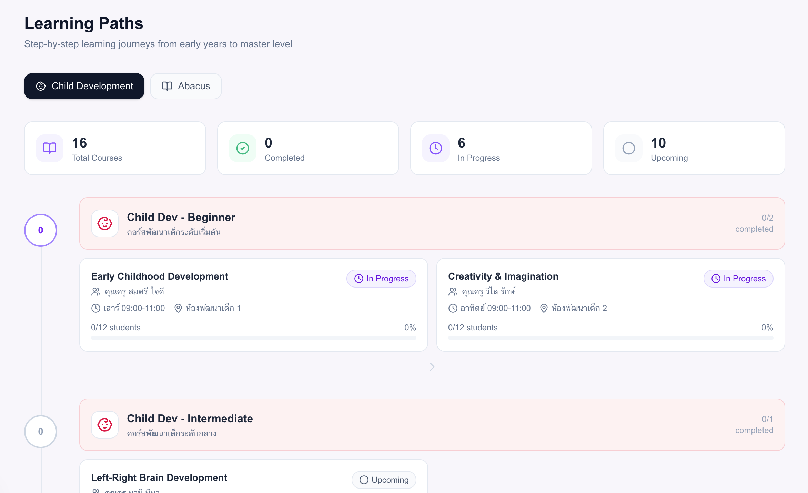
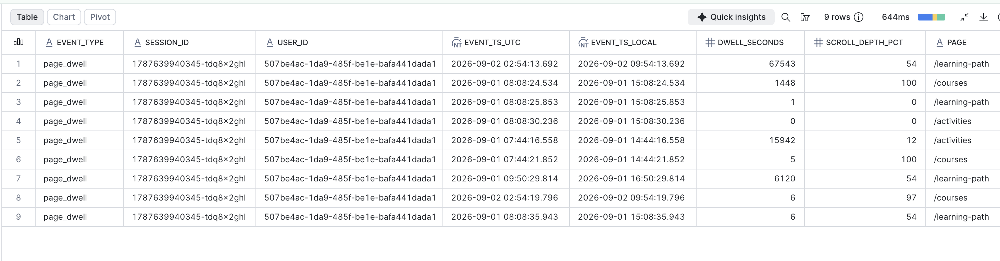
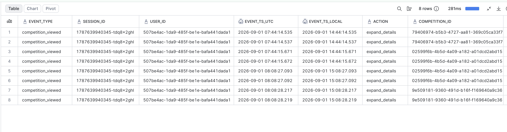
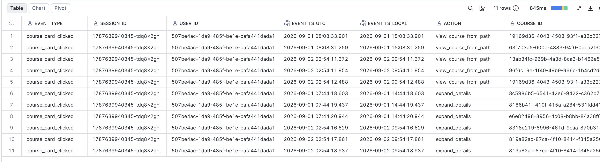
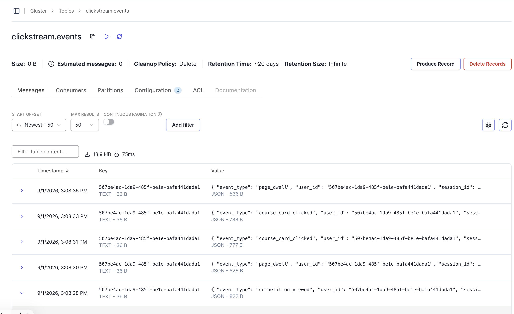
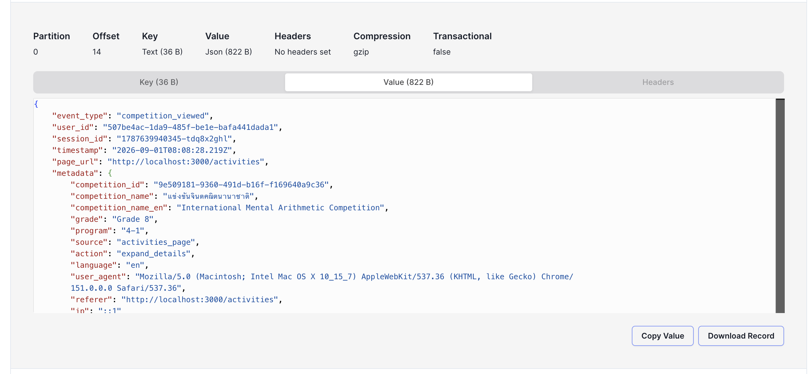

# Clickstream Pipeline — Kafka → Snowflake

Ingests `clickstream.events` from Kafka into Snowflake via the **Snowflake
Connector for Kafka v4** (Snowpipe Streaming), landing raw JSON in
`ABACUS_ANALYTICS.RAW` and exposing typed views in `ABACUS_ANALYTICS.STAGING`.

```
producer → kafka → connect worker → snowflake
                                    └── ABACUS_ANALYTICS.RAW.CLICKSTREAM_EVENTS
```

## The source application

Events come from an education platform for **abacus (mental arithmetic) and
early child-development programs**, running locally at
`http://localhost:3000`. Parents and students use it to browse and register for
courses, track learning progress, and find skills competitions.

Every interaction emits a JSON event to the `clickstream.events` topic, so
clicking through the UI exercises the whole pipeline — no synthetic producer
needed.




*Clicking a competition here produces a `competition_viewed` event; scrolling
and staying on the page produces `page_dwell` and `course_card_clicked`*

---

## Contents

- [Prerequisites](#prerequisites)
- [Phase 1 — Snowflake: the destination](#phase-1--snowflake-the-destination)
- [Phase 2 — Keys: the identity](#phase-2--keys-the-identity)
- [Phase 3 — The connector](#phase-3--the-connector)
- [Phase 4 — Confirm and shape](#phase-4--confirm-and-shape)
- [Operating the connector](#operating-the-connector)
- [Troubleshooting](#troubleshooting)
- [Repository layout](#repository-layout)

---

## Prerequisites

| Requirement | Notes |
|---|---|
| Snowflake account with `ACCOUNTADMIN` | Account identifier: `KNSMANR-BL10477` |
| Kafka broker reachable from the Connect worker | Internal listener `kafka:9092` |
| Docker with Compose | Kafka, Redpanda Console and Connect all run here |
| `openssl`, `jq`, `curl` | Standard on macOS |


---

## Phase 1 — Snowflake: the destination

### 1. Database and schemas

```sql
USE ROLE ACCOUNTADMIN;

CREATE DATABASE IF NOT EXISTS ABACUS_ANALYTICS;
CREATE SCHEMA   IF NOT EXISTS ABACUS_ANALYTICS.RAW;      -- append-only JSON landing
CREATE SCHEMA   IF NOT EXISTS ABACUS_ANALYTICS.RAW_APP;  -- Postgres sync, typed at source
CREATE SCHEMA   IF NOT EXISTS ABACUS_ANALYTICS.STAGING;  -- typed views over RAW
```


> A Personal Database (`USER$<name>`) will not work as a target — privileges on
> its objects cannot be granted to account roles, `CREATE` least of all.

### 2. Role and service user

```sql
CREATE ROLE IF NOT EXISTS KAFKA_INGEST_ROLE;

CREATE USER IF NOT EXISTS KAFKA_INGEST_SVC
    TYPE         = SERVICE
    DEFAULT_ROLE = KAFKA_INGEST_ROLE;
```

`TYPE = SERVICE` cannot hold a password and cannot enrol in MFA, so key-pair
auth is the only way in. That is all connector v4 supports, and what Snowflake
now requires for non-human users.

> **Gate** — `SHOW USERS LIKE 'KAFKA_INGEST_SVC';` must return one row.

---

## Phase 2 — Keys: the identity

### 3. Generate the key pair

Find the host folder mounted into the container first, so the files land where
the connector can read them:

```bash
docker inspect connect \
  --format '{{range .Mounts}}{{.Source}} -> {{.Destination}}{{"\n"}}{{end}}'
```

Then, inside the path that maps to `/opt/kafka/secrets`:

```bash
openssl genrsa 2048 | openssl pkcs8 -topk8 -inform PEM -nocrypt -out sf_key.p8
openssl rsa -in sf_key.p8 -pubout -out sf_key.pub
```

> **Gate — the one that cost the most time.**
> ```bash
> head -1 sf_key.pub    # must print: -----BEGIN PUBLIC KEY-----
> ```
> If it says `PRIVATE` or `ENCRYPTED`, stop and regenerate. Every later step
> fails in a way that never mentions keys.

Two files, two destinations:

| File | Half | Goes to |
|---|---|---|
| `sf_key.p8` | private | stays on this machine, read by the connector |
| `sf_key.pub` | public | registered in Snowflake |

Quick identification: a 2048-bit **public** key body starts
`MIIBIjANBgkqhkiG9w0BAQEFAAOCAQ8A` and runs ~392 chars. A **private** key
starts `MIIEv` / `MIIEp` / `MIIFD` and runs 1200+.

### 4. Private half → the secrets file

```bash
printf 'private_key=%s\n' "$(grep -v '^-----' sf_key.p8 | tr -d '\n')" \
  > snowflake.properties
chmod 600 snowflake.properties
```

> **Gate**
> ```bash
> wc -c snowflake.properties    # ~1637 bytes. ~13 means it is EMPTY.
> wc -l snowflake.properties    # must be 1 — a newline breaks the parser
> ```
> Do not use a heredoc here. If the `$(grep …)` substitution fails, a heredoc
> writes the file anyway with an empty value and says nothing.

### 5. Public half → Snowflake

Generate the whole statement so there is nothing to hand-edit:

```bash
echo "ALTER USER KAFKA_INGEST_SVC SET RSA_PUBLIC_KEY = '$(grep -v '^-----' sf_key.pub | tr -d '\n')';" | pbcopy
```

Paste into Snowsight and run.

> **Gate** — `DESC USER KAFKA_INGEST_SVC;` → `RSA_PUBLIC_KEY_FP` must show
> `SHA256:…`. Blank means it did not register.

### 6. Grants

```sql
GRANT USAGE        ON DATABASE ABACUS_ANALYTICS     TO ROLE KAFKA_INGEST_ROLE;
GRANT USAGE        ON SCHEMA   ABACUS_ANALYTICS.RAW TO ROLE KAFKA_INGEST_ROLE;
GRANT CREATE TABLE ON SCHEMA   ABACUS_ANALYTICS.RAW TO ROLE KAFKA_INGEST_ROLE;

GRANT ROLE KAFKA_INGEST_ROLE TO USER KAFKA_INGEST_SVC;
```

`CREATE TABLE` because the connector creates its own target — and owns what it
creates, so `INSERT` comes along automatically. No warehouse grant: Snowpipe
Streaming ingestion is serverless.

So you can read the data yourself afterwards:

```sql
GRANT ROLE KAFKA_INGEST_ROLE TO ROLE SYSADMIN;
GRANT SELECT ON FUTURE TABLES IN SCHEMA ABACUS_ANALYTICS.RAW TO ROLE SYSADMIN;
```

Without this, even `ACCOUNTADMIN` gets *Insufficient privileges* on the
connector-created table — it is owned by a role outside that hierarchy.
`FUTURE TABLES` covers every topic you add later.

> **Gate** — `SHOW GRANTS TO ROLE KAFKA_INGEST_ROLE;` → four rows.

---

## Phase 3 — The connector

### 7. Connector config

`connectors/snowflake-sink-v4.json`

```json
{
  "name": "clickstream-snowflake-sink",
  "config": {
    "connector.class": "com.snowflake.kafka.connector.SnowflakeStreamingSinkConnector",
    "tasks.max": "4",

    "topics": "clickstream.events",
    "snowflake.topic2table.map": "clickstream.events:CLICKSTREAM_EVENTS",

    "snowflake.url.name": "https://KNSMANR-BL10477.snowflakecomputing.com",
    "snowflake.user.name": "KAFKA_INGEST_SVC",
    "snowflake.role.name": "KAFKA_INGEST_ROLE",
    "snowflake.database.name": "ABACUS_ANALYTICS",
    "snowflake.schema.name": "RAW",

    "snowflake.private.key": "${file:/opt/kafka/secrets/snowflake.properties:private_key}",

    "key.converter": "org.apache.kafka.connect.storage.StringConverter",
    "value.converter": "org.apache.kafka.connect.json.JsonConverter",
    "value.converter.schemas.enable": "false",

    "snowflake.enable.schematization": "true",
    "snowflake.streaming.validate.compatibility.with.classic": "false",

    "errors.tolerance": "all",
    "errors.log.enable": "true",
    "errors.deadletterqueue.topic.name": "clickstream.events.dlq",
    "errors.deadletterqueue.topic.replication.factor": "1"
  }
}
```

Every value must match Phase 1 exactly. That string matching, plus the key
pair, is the **entire** link between Kafka and Snowflake.

Three settings that are easy to get wrong:

- **`snowflake.private.key`** must use the *container* path
  `/opt/kafka/secrets/…`. A host path (`/Users/…`) fails with
  `Could not read properties from file` — the connector resolves it inside the
  container, where that path does not exist.
- **`snowflake.streaming.validate.compatibility.with.classic: "false"`** is
  required for a fresh install. v4 defaults it to `true`, which then demands
  four v3-migration settings and blocks startup. It exists to protect people
  migrating from connector v3; there is nothing to protect here.
- **`…deadletterqueue.topic.replication.factor: "1"`** on a single broker.
  With `3`, the first malformed message crashes the error handler itself.

Omit `snowflake.private.key.passphrase` entirely — the key above is
`-nocrypt`. Pointing it at a nonexistent properties entry resolves to empty and
fails during decryption.

### 8. Start the Connect worker

```bash
cd docker
docker compose -f docker-compose.yml -f docker-compose.connect.yml up -d
docker compose -f docker-compose.yml -f docker-compose.connect.yml logs -f connect
```

Pass **both** files so Connect joins the same Compose project as Kafka and can
resolve `kafka:9092`. A standalone run creates its own network, and the worker
dies with `No resolvable bootstrap urls given in bootstrap.servers`.

First start downloads the connector — allow two or three minutes. Port 8083 is
published immediately but accepts nothing until the JVM binds it.

> **Gate — three checks**
> ```bash
> docker exec connect ls -l /opt/kafka/secrets     # lists snowflake.properties
> docker exec connect nc -zv kafka 9092            # network join works
> curl -s localhost:8083/connector-plugins | jq -r '.[].class' | grep -i snowflake
> ```
> An empty first result means the volume path is wrong. Docker creates an empty
> directory rather than failing.

### 9. Deploy

```bash
curl -s -X POST -H "Content-Type: application/json" \
  --data @connectors/snowflake-sink-v4.json \
  localhost:8083/connectors | jq
```

> **Never use `curl -f` against the Connect API.** It discards the response
> body on a 4xx/5xx — which is exactly where the error message lives.

```bash
curl -s localhost:8083/connectors/clickstream-snowflake-sink/status | jq
```

> **Gate** — `state: RUNNING` for the connector **and** all four tasks.

Read the *whole* status object. `.connector.trace` and `.tasks[].trace` are
different failures, and a connector that fails during startup never creates
tasks — so the task array is empty and the only explanation is on the connector.

---

## Phase 4 — Confirm and shape

### 10. Data is landing

```sql
SELECT TABLE_SCHEMA, TABLE_NAME, ROW_COUNT, CREATED
FROM ABACUS_ANALYTICS.INFORMATION_SCHEMA.TABLES
ORDER BY CREATED DESC;

SELECT * FROM ABACUS_ANALYTICS.RAW.CLICKSTREAM_EVENTS LIMIT 5;
DESC TABLE ABACUS_ANALYTICS.RAW.CLICKSTREAM_EVENTS;
```

With schematization on, each top-level JSON key becomes a column:

| Column | Type | Notes |
|---|---|---|
| `EVENT_TYPE`, `USER_ID`, `SESSION_ID`, `PAGE_URL` | `VARCHAR` | already typed |
| `TIMESTAMP` | `TIMESTAMP_NTZ` | **already parsed** — do not wrap in `TRY_TO_TIMESTAMP_TZ` |
| `METADATA` | `OBJECT` | nested fields, reached with `:` |
| `RECORD_METADATA` | `VARIANT` | Kafka topic / partition / offset |

### 11. Typed views

`RAW` stays exactly what Kafka sent. All shaping happens in `STAGING`, so a
producer-side change never means editing landed data.

```sql
CREATE OR REPLACE VIEW ABACUS_ANALYTICS.STAGING.PAGE_DWELL AS
SELECT
    EVENT_TYPE                     AS event_type,
    SESSION_ID                     AS session_id,
    USER_ID                        AS user_id,
    "TIMESTAMP"                    AS event_ts_utc,
    CONVERT_TIMEZONE('UTC', 'Asia/Bangkok', "TIMESTAMP") AS event_ts_local,
    METADATA:dwell_seconds::INT    AS dwell_seconds,
    METADATA:scroll_depth_pct::INT AS scroll_depth_pct,
    METADATA:page::STRING          AS page,
    METADATA:referer::STRING       AS referer,
    METADATA:ip::STRING            AS ip,
    METADATA:user_agent::STRING    AS user_agent,
    RECORD_METADATA:partition::INT AS kafka_partition,
    RECORD_METADATA:offset::BIGINT AS kafka_offset
FROM ABACUS_ANALYTICS.RAW.CLICKSTREAM_EVENTS
WHERE EVENT_TYPE = 'page_dwell'
-- Kafka is at-least-once: a restart can re-deliver messages.
-- (partition, offset) is unique and stable, so this collapses duplicates.
QUALIFY ROW_NUMBER() OVER (
    PARTITION BY RECORD_METADATA:partition::INT,
                 RECORD_METADATA:offset::BIGINT
    ORDER BY 1
) = 1;
```



```sql
CREATE OR REPLACE VIEW ABACUS_ANALYTICS.STAGING.COMPETITION_VIEWED AS
SELECT
    EVENT_TYPE                           AS event_type,
    SESSION_ID                           AS session_id,
    USER_ID                              AS user_id,
    "TIMESTAMP"                          AS event_ts_utc,
    CONVERT_TIMEZONE('UTC', 'Asia/Bangkok', "TIMESTAMP") AS event_ts_local,
    METADATA:action::STRING              AS action,
    METADATA:competition_id::STRING      AS competition_id,
    METADATA:competition_name::STRING    AS competition_name,
    METADATA:competition_name_en::STRING AS competition_name_en,
    METADATA:grade::STRING               AS grade,
    METADATA:program::STRING             AS program,
    METADATA:language::STRING            AS language,
    METADATA:source::STRING              AS source,
    METADATA:referer::STRING             AS referer,
    METADATA:ip::STRING                  AS ip,
    METADATA:user_agent::STRING          AS user_agent
FROM ABACUS_ANALYTICS.RAW.CLICKSTREAM_EVENTS
WHERE EVENT_TYPE = 'competition_viewed';
```


```sql
USE ROLE ACCOUNTADMIN;
USE DATABASE ABACUS_ANALYTICS;

CREATE SCHEMA IF NOT EXISTS ABACUS_ANALYTICS.STAGING;

CREATE OR REPLACE VIEW ABACUS_ANALYTICS.STAGING.COURSE_CARD_CLICKED AS
SELECT
    EVENT_TYPE                              AS event_type,
    SESSION_ID                              AS session_id,
    USER_ID                                 AS user_id,
    "TIMESTAMP"                             AS event_ts_utc,
    CONVERT_TIMEZONE('UTC', 'Asia/Bangkok', "TIMESTAMP") AS event_ts_local,
    METADATA:action::STRING                 AS action,
    METADATA:course_id::STRING              AS course_id,
    METADATA:course_name::STRING            AS course_name,
    METADATA:course_name_en::STRING         AS course_name_en,
    METADATA:ip::STRING                     AS ip,
    METADATA:language::STRING               AS language,
    METADATA:path_type::STRING              AS path_type,
    METADATA:referer::STRING                AS referer,
    METADATA:source::STRING                 AS source,
    METADATA:user_agent::STRING             AS user_agent
FROM ABACUS_ANALYTICS.RAW.CLICKSTREAM_EVENTS
WHERE EVENT_TYPE = 'course_card_clicked';

```

**Casting rules for this data**

- `:` walks into JSON, `::` casts out of VARIANT. `METADATA:dwell_seconds::INT`.
  `METADATA::dwell_seconds` means "cast to a type named DWELL_SECONDS" and
  errors.
- `ip` is **always `::STRING`** — values include `::1` (IPv6 loopback).
- Comparisons use `=` and single quotes: `EVENT_TYPE = 'page_dwell'`. Double
  quotes mean an identifier; `==` is not SQL.
- Every `:` path needs a `::type`. Without it you get a VARIANT, and
  `METADATA:page = '/activities'` will not match because the JSON string keeps
  its quotes.

> **Gate**
> ```sql
> SELECT page, COUNT(*) AS events, AVG(dwell_seconds) AS avg_dwell
> FROM ABACUS_ANALYTICS.STAGING.PAGE_DWELL
> GROUP BY page ORDER BY events DESC;
> ```

**Data quality note.** Observed rows include `dwell_seconds: 1448` with
`scroll_depth_pct: 100` — a tab left open, not engagement. Cap dwell in the
view before feeding it anything downstream:

```sql
    LEAST(METADATA:dwell_seconds::INT, 300) AS dwell_seconds_capped,
    METADATA:dwell_seconds::INT             AS dwell_seconds_raw,
```

---

## Operating the connector

```bash
# list connectors
curl -s localhost:8083/connectors | jq

# health (use this most)
curl -s localhost:8083/connectors/clickstream-snowflake-sink/status | jq

# update config on a running connector — inner config object only
jq .config connectors/snowflake-sink-v4.json | \
  curl -s -X PUT -H "Content-Type: application/json" --data @- \
  localhost:8083/connectors/clickstream-snowflake-sink/config | jq

# restart failed tasks
curl -s -X POST "localhost:8083/connectors/clickstream-snowflake-sink/restart?includeTasks=true&onlyFailed=true"

# remove (Kafka offsets are retained, so recreating resumes)
curl -s -X DELETE localhost:8083/connectors/clickstream-snowflake-sink
```

`POST` creates, `PUT /config` updates. POSTing an existing name returns 409.

Check the topic and consumer lag:

```bash
docker exec docker-kafka-1 /opt/kafka/bin/kafka-get-offsets.sh \
  --bootstrap-server localhost:9092 --topic clickstream.events

docker exec docker-kafka-1 /opt/kafka/bin/kafka-consumer-groups.sh \
  --bootstrap-server localhost:9092 --describe \
  --group connect-clickstream-snowflake-sink
```

`LAG 0` means the connector consumed everything — and since Connect commits
offsets only after a successful write, the rows reached Snowflake.

Redpanda Console at <http://localhost:8080> is faster for browsing topics.



---

## Troubleshooting

| Symptom | Cause | Fix |
|---|---|---|
| `User 'KAFKA_INGEST_SVC' does not exist` | Snowsight ran only one statement | Use Run All, or run statements individually |
| `New public key rejected … 'Invalid Public key'` | Pasted the private key | `head -1 sf_key.pub` must say PUBLIC |
| Connector `FAILED`, `tasks: []` | Config validation failed at startup | Read `.connector.trace`, not `.tasks[]` |
| `Config value 'snowflake.streaming.classic.offset.migration' is invalid` | v4 compatibility gate | Set `…validate.compatibility.with.classic: "false"` |
| `Could not read properties from file /Users/…` | Host path in `${file:…}` | Use `/opt/kafka/secrets/…` |
| `No resolvable bootstrap urls` | Connect on the wrong Docker network | Run both compose files as one project |
| `Recv failure: Connection reset by peer` | Worker still starting | `until curl -sf localhost:8083/; do sleep 5; done` |
| Bare `error: 500` with no detail | `curl -f` discarded the body | Use `-s`, add `-w '\nHTTP %{http_code}\n'` |
| `Insufficient privileges … CLICKSTREAM_EVENTS` | Table owned by the ingest role | `GRANT ROLE KAFKA_INGEST_ROLE TO ROLE SYSADMIN` |
| `TRY_CAST cannot be used with … TIMESTAMP_NTZ and TIMESTAMP_TZ` | `TIMESTAMP` is already typed | Use `"TIMESTAMP"` directly |
| `Unsupported data type 'DWELL_SECONDS'` | `::` where `:` belongs | `METADATA:dwell_seconds::INT` |
| `Numeric value '::1' is not recognized` | `ip` cast to a number | `METADATA:ip::STRING` |
| `Found orphan containers` | Second Compose project | `docker compose ls -a`, remove duplicates |

**Debugging habits that would have saved hours**

1. Verify after every step, not at the end — six failures produced no error
   where the fault actually was.
2. Never `curl -f` an API you are debugging.
3. `head -1` any key file before using it.
4. Use absolute paths; the working directory changes constantly between host,
   container and subfolders.
5. One Compose project per stack.

---

## Repository layout

```
course-recommendation-pipeline/
├── README.md
├── connectors/
│   ├── snowflake-sink-v4.json      # connector config (safe to commit)
│   ├── snowflake.properties        # GITIGNORED — private key
│   └── secrets/
│       ├── sf_key.p8               # GITIGNORED
│       └── sf_key.pub              # GITIGNORED
├── docker/
│   ├── docker-compose.yml          # kafka + console
│   └── docker-compose.connect.yml  # connect worker overlay
├── scripts/
│   ├── produce_kafka.py
│   └── consumer_kafka.py
└── sql/
    ├── 01_setup.sql                # db, schemas, role, user, grants
    ├── 02_view_page_dwell.sql
    └── 03_view_competition_viewed.sql
```

Add to `.gitignore`:

```gitignore
connectors/snowflake.properties
connectors/**/*.p8
connectors/**/*.pub
```

Verify:

```bash
git check-ignore -v connectors/snowflake.properties connectors/secrets/sf_key.p8
```

Silence means they are **not** ignored — fix before committing.

---

## Status

Pipeline is live. Connector `RUNNING` with 4/4 tasks; rows landing in
`ABACUS_ANALYTICS.RAW.CLICKSTREAM_EVENTS`.

**Next work, in priority order:**

1. **Conversion events** — `registration_started`, `registration_completed`.
   Without a conversion signal there is no target variable, so no
   recommendation model can be trained or evaluated.
2. **Impression events** — what was *shown* and ignored, with `position` in the
   list. Needed to distinguish "not interested" from "never seen", and to
   debias training data.
3. **Item catalog in `RAW_APP`** — competition attributes and, critically,
   `registration_closes`. Recommending an expired competition is worse than
   recommending nothing.

Events not logged today are permanently lost. A model can be backfilled; a
behavioral log cannot.
